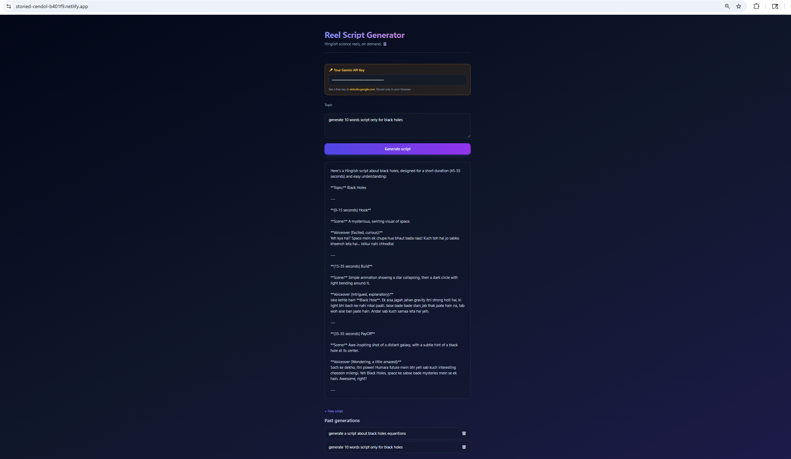

<!-- @format -->

# 🎬 Hinglish sciReel AI

> Generate Hinglish science reel scripts in Hook–Build–Payoff format.

[Live demo](https://hinglish-scireel-ai.netlify.app/) · [Screenshot below]

## What it is

An AI script generator for science creators. Type a topic, get a structured Hinglish reel script " Hook, Build, and Payoff " written for an audience that's new to science.

## Why I built it

I run a Hinglish science Instagram channel. Where i explore variety of science conepets and try to share my thoughts with audiance, so in here this app could generate you an idea and also could give you though process to make that idea into script for reels.

## Tech

- Vanilla HTML, CSS, JavaScript (no frameworks)
- Tailwind CSS via CDN
- Gemini 2.5 Flash Lite API
- localStorage for persistence
- Deployed on Netlify

## How to run it

1. Visit the [live demo](https://hinglish-scireel-ai.netlify.app/)
2. Get a free Gemini API key from [aistudio.google.com](https://aistudio.google.com/apikey)
3. Paste the key into the input field on the page
4. Type a science topic and click Generate

The key is stored only in your browser's localStorage — it never leaves your device.

## Features

- generates Hinglish scripts in Hook,Build,PayOff format.
- it can also store all your previous chats with topic and full response including proper format.
- It also has memory to keep your api key saved so next time you visit the page, no worries you can directly start exploring ideas without any interruptions.

## What I learned

- I revised the below listed topic while making this AI app

- How fetch + async/await actually work — sending a request, waiting for response
- Why JSON.stringify going out, .json() coming in
- try/catch/finally for handling API + network failures separately
- How localStorage stores only strings, and why JSON.parse/stringify is needed
- How to read API docs and identify the 4 things that change between providers

## What's next (v2)

- Rename history items
- Search past generations
- Copy script to clipboard
- Move API key to a backend (Netlify Function) so users don't need their own
- English-only mode toggle

## Screenshot

Built over a weekend in May 2026 as part of my journey breaking the tutorial-loop pattern. Project-first learning > another course.
